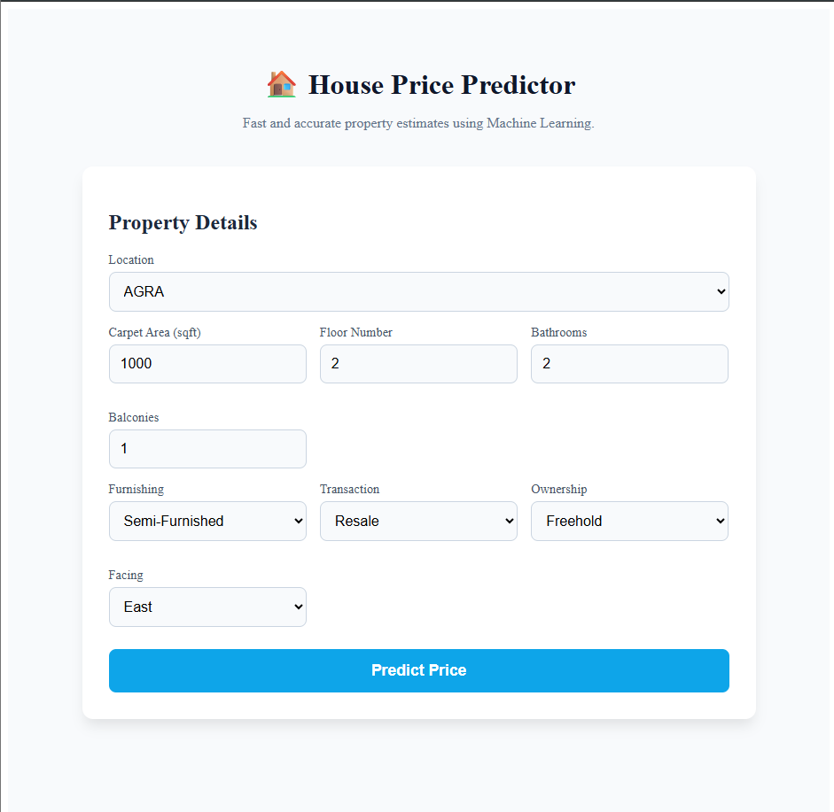
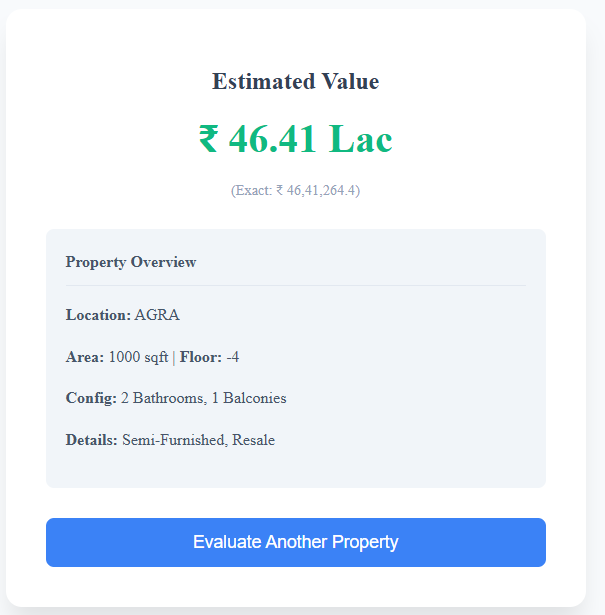
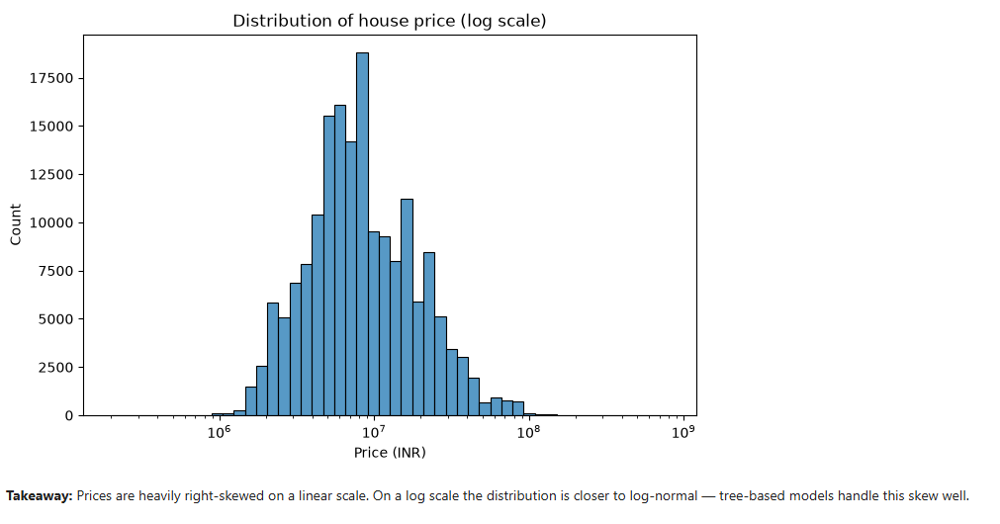
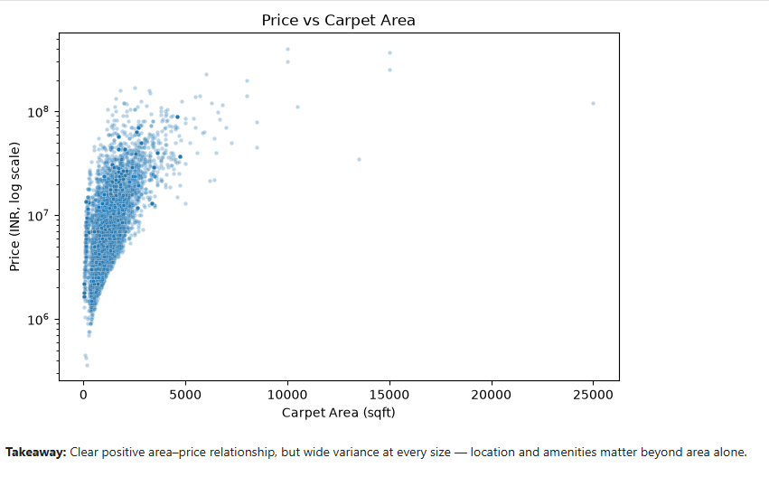
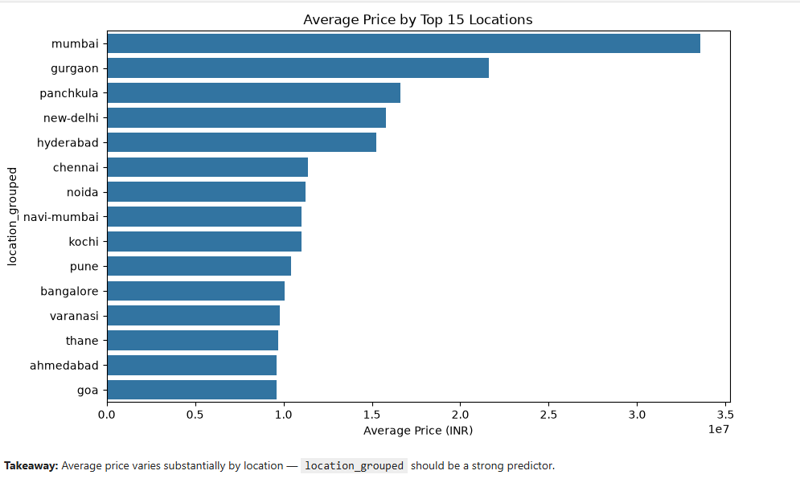
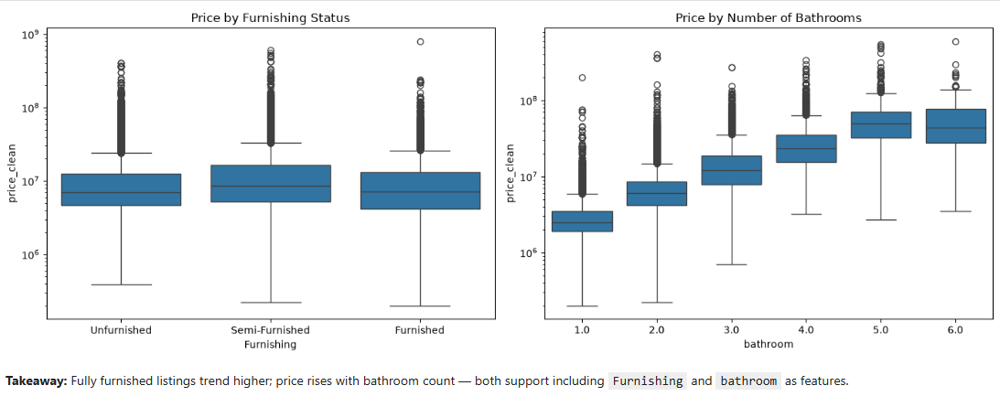
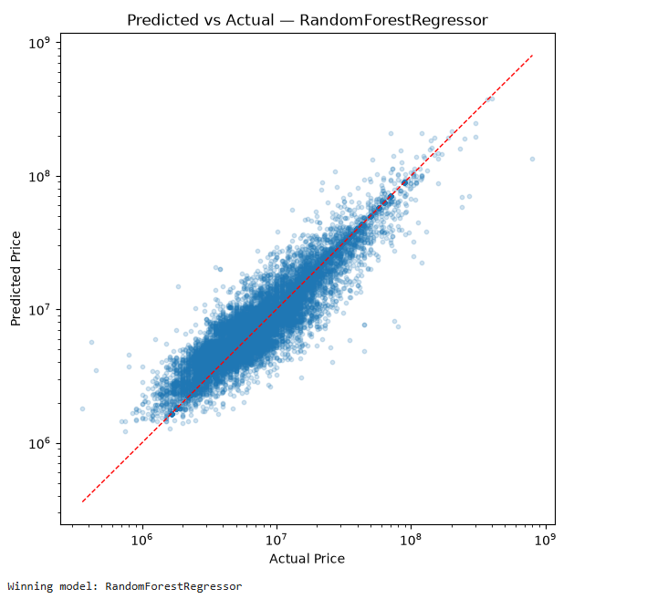

# 🏠 House Price Predictor

An end-to-end Machine Learning web app that predicts residential property prices in India (₹ INR) from details like area, floor, bathrooms, and location.

It's made of three parts: a **React** form where you enter property details, a **FastAPI** backend that runs the model, and a **Random Forest** model trained on ~187,000 real listings.

[](https://www.python.org/)
[](https://fastapi.tiangolo.com/)
[](https://reactjs.org/)
[](https://www.typescriptlang.org/)
[](https://scikit-learn.org/)
[](https://vitejs.dev/)

---

## 📖 Table of Contents

1. [Demo](#-demo)
2. [How It Works](#-how-it-works)
3. [The Dataset](#-the-dataset)
4. [Data Exploration](#-data-exploration)
5. [Model Performance](#-model-performance)
6. [Project Structure](#-project-structure)
7. [Getting Started](#-getting-started)
8. [API Reference](#-api-reference)
9. [Author](#-author)

---

## 🎬 Demo

Fill in the property form, hit **Predict Price**, and get an instant valuation.

<table>
<tr>
<td width="50%" align="center"><b>Input Form</b></td>
<td width="50%" align="center"><b>Prediction Result</b></td>
</tr>
<tr>
<td></td>
<td></td>
</tr>
</table>

---

## ⚙️ How It Works

```text
   React + TypeScript Form            FastAPI Backend              Trained Model
   (user enters property   ─POST──▶   (validates input,   ──────▶  (Random Forest
    details in the browser)            calls the model)             predicts price)
```

1. The user fills in property details in the React form.
2. The frontend sends the data as JSON to the FastAPI backend (`POST /predict`).
3. FastAPI validates the request, then passes it through the saved Scikit-Learn pipeline (`house_price.pkl`).
4. The pipeline encodes the features and the Random Forest model returns a predicted price, which is sent back and shown to the user.

---

## 📊 The Dataset

* **Source:** [House Price Dataset by Juhi Bhojani (Kaggle)](https://www.kaggle.com/datasets/juhibhojani/house-price) — ~187,000 property listings across India.
* **Target:** `price_clean` — the property price in INR.

**Features used:**

| Feature | Description |
| :--- | :--- |
| `carpet_area_sqft` | Usable floor area in square feet |
| `floor_num` | Floor level (Ground → 0, Basement → -1, etc.) |
| `bathroom` | Number of bathrooms |
| `balcony` | Number of balconies |
| `location_grouped` | Top 50 localities, everything else grouped as `"other"` |
| `Furnishing` | Unfurnished / Semi-Furnished / Furnished |
| `Transaction` | New / Resale |
| `Ownership` | Freehold / Leasehold / etc. |
| `facing` | Direction the property faces |

**Cleaning highlights:**
* Standardized prices written in `Lac` (×10⁵) and `Cr` (×10⁷) into one numeric column.
* Normalized area values from sqft / sqm / sq. yards into a single `sqft` column.
* Parsed messy floor text (e.g. `"3 out of 10"`, `"Ground"`) into clean numeric floor levels.
* Removed extreme price-per-sqft outliers (below the 1st and above the 99th percentile — about 3.2k rows).
* Grouped rare locations/societies into an `"other"` bucket to avoid an explosion of categories.

---

## 🔎 Data Exploration

**Prices are heavily right-skewed** — most homes cluster in a lower range with a long tail of expensive properties, which is why the model works on a log-friendly, tree-based approach.



**Bigger area generally means a higher price**, though the spread at every size shows that area alone doesn't decide the price — location and amenities matter too.



**Location drives price the most.** Mumbai, Gurgaon, and Panchkula top the list of the priciest cities.



**Furnishing and bathroom count both matter.** Fully furnished listings trend higher, and price climbs steadily as bathroom count increases.



---

## 📈 Model Performance

Three models were trained and compared on a 20% held-out test set:

| Model | MAE (INR) | RMSE (INR) | R² Score | Status |
| :--- | :---: | :---: | :---: | :---: |
| **Random Forest Regressor** | **₹ 1,114,024** | **₹ 5,306,273** | **0.8492** | 🏆 **Selected** |
| Gradient Boosting Regressor | ₹ 2,613,991 | ₹ 6,134,626 | 0.7985 | Evaluated |
| Linear Regression (Baseline) | ₹ 4,521,805 | ₹ 8,407,485 | 0.6214 | Baseline |

> 5-Fold Cross-Validation Mean R² = **0.8801 (± 0.0243)**

Random Forest won because it handles the non-linear relationships between floor level, area, and location tiers much better than the linear baseline.



*Points close to the red diagonal line are accurate predictions — the model tracks actual prices well across most of the range.*

---

## 📁 Project Structure

```text
house-price-project/
├── backend/                 # FastAPI service
│   ├── app/
│   │   ├── api/routes/      # /predict and /health endpoints
│   │   ├── core/            # App configuration
│   │   ├── schemas/         # Request/response models (Pydantic)
│   │   └── services/        # Preprocessing + model inference
│   ├── models/
│   │   └── house_price.pkl  # Trained Scikit-Learn pipeline
│   ├── tests/                # Automated tests
│   └── requirements.txt
├── frontend/                 # React + TypeScript client
│   └── src/
│       ├── api/              # Typed HTTP client
│       ├── components/       # Prediction form
│       ├── pages/            # Home / Result / 404
│       └── types/            # TypeScript interfaces
├── notebooks/
│   └── house_price_model.ipynb   # EDA, cleaning, model training
└── README.md
```

---

## 🚀 Getting Started

### Prerequisites
* Python 3.11+
* Node.js 18+ and npm
* Git

### 1. Download the dataset
```bash
kaggle datasets download -d juhibhojani/house-price -p notebooks/data --unzip
```

### 2. Run the backend (FastAPI)
```bash
cd backend
python -m venv .venv
source .venv/bin/activate      # Windows: .venv\Scripts\activate

pip install -r requirements.txt
pytest tests/ -v                # optional: run tests
uvicorn app.main:app --reload --port 8000
```
* API docs: `http://localhost:8000/docs`
* Health check: `http://localhost:8000/health`

### 3. Run the frontend (React + Vite)
```bash
cd frontend
npm install
npm run dev
```
* App: `http://localhost:5173`

---

## 🔌 API Reference

### `POST /predict`

**Request:**
```json
{
  "carpet_area_sqft": 1200.0,
  "floor_num": 3,
  "bathroom": 2,
  "balcony": 1,
  "location": "thane",
  "furnishing": "Semi-Furnished",
  "transaction": "Resale",
  "ownership": "Freehold",
  "facing": "East"
}
```

**Response:**
```json
{
  "predicted_price": 9850000.0
}
```

---

## 🧑‍💻 Author

Built with clean architecture and production-ready ML engineering in mind.
Contributions, issues, and feature requests are always welcome — feel free to open a PR! ⭐
